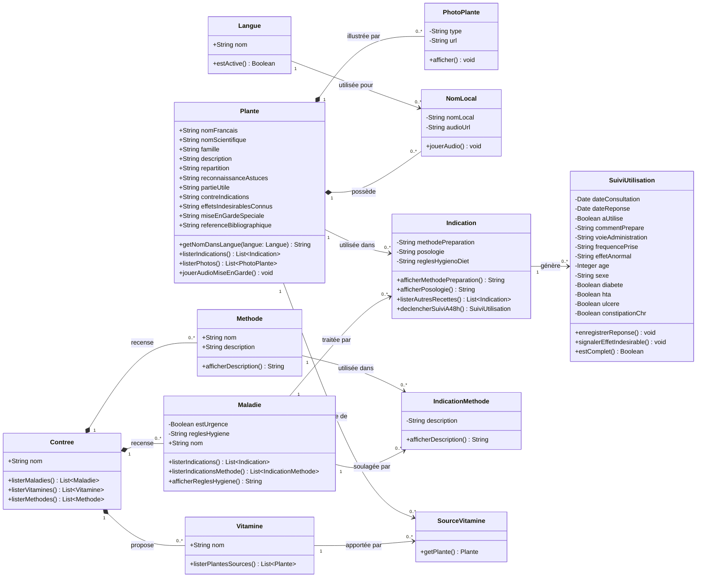
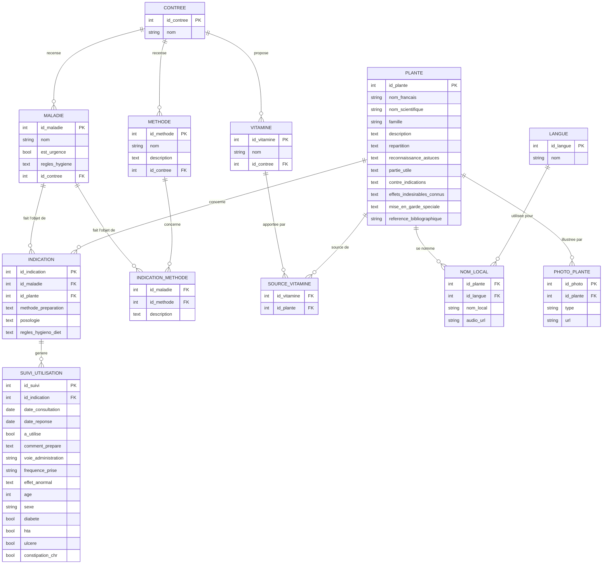

# Modèle conceptuel de données - Afro Mansin

> Sources : `afro-mansin-05042026-Vf pdf.pdf` (31 écrans) + `ECHANTILLON_BASE APP EXCEL.xlsx` (échantillon de données réelles)
> Notation : Merise (MCD) + attributs typés
> Dernière mise à jour : 21 septembre 2026

## Sommaire

1. [Périmètre et méthode](#1-périmètre-et-méthode)
2. [Catalogue des entités](#2-catalogue-des-entités)
3. [Diagramme de classes UML](#3-diagramme-de-classes-uml)
4. [Diagramme entité-association](#4-diagramme-entité-association)
5. [Dictionnaire des associations](#5-dictionnaire-des-associations)
6. [Hypothèses de modélisation](#6-hypothèses-de-modélisation)

---

## 1. Périmètre et méthode

Douze entités ont été extraites de deux sources croisées : la maquette illustrée (31 écrans, la
structure de navigation et les parcours) et un **échantillon Excel de données réelles**
(`ECHANTILLON_BASE APP EXCEL.xlsx`, 3 fiches plantes traitant la constipation) qui montre le détail
exact des champs à renseigner pour chaque plante. Trois points d'entrée (**Maladie**, **Vitamines**,
**Urgences**) convergent tous vers une fiche **Plante** détaillée, plus un module de **suivi
post-utilisation** (questionnaire à 48h) qui n'apparaît qu'une fois dans le PDF mais structure une
bonne partie du modèle.

Quatre constats ont guidé les choix de modélisation :

- le contenu d'une recette est spécifique au **couple** maladie + plante — une même plante affiche
  une recette différente selon le mal traité (bouton « Autres recettes ») — et non à la plante
  seule ;
- une maladie comme « Hémorragie » peut renvoyer soit vers une **Plante**, soit vers une **Méthode**
  non végétale, ce qui justifie deux associations distinctes plutôt qu'une seule polymorphe ;
- le PDF (*Recette*, *Mode d'emploi*) et l'Excel (*Méthode de préparation*, *Posologie*) nomment
  différemment les deux mêmes informations — elles ont été fusionnées en `methode_preparation` et
  `posologie` sur l'entité INDICATION ;
- l'Excel révèle des champs fiche-plante absents de la maquette (répartition géographique, astuces
  de reconnaissance, contre-indications, effets indésirables connus, référence bibliographique) et
  montre que les photos ne sont pas limitées à trois emplacements fixes — d'où la nouvelle entité
  **PHOTO_PLANTE**.

---

## 2. Catalogue des entités

Légende : **PK** = clé primaire, **FK** = clé étrangère.

### CONTREE — référentiel

| Attribut | Type |
|---|---|
| `id_contree` | **PK** |
| `nom` | texte |

*Vu dans : liste alphabétique de pays africains (Algérie, Bénin, Côte d'Ivoire, Zambie…), premier filtre de tous les parcours.*

### LANGUE — référentiel

| Attribut | Type |
|---|---|
| `id_langue` | **PK** |
| `nom` | texte |

*Vu dans : Français + langues locales sur la fiche plante, chacune avec un bouton audio. Le PDF
montre Fon, Adja, Yoruba, Dendi ; l'échantillon Excel montre Français, Anglais, Fon, Yoruba, Goun,
avec deux colonnes de langue laissées vides dans l'en-tête — signe que la liste est volontairement
extensible. Ensemble harmonisé retenu : Français, Anglais, Fon, Adja, Yoruba, Dendi, Goun.*

### MALADIE — cœur de domaine

| Attribut | Type |
|---|---|
| `id_maladie` | **PK** |
| `nom` | texte |
| `est_urgence` | booléen |
| `regles_hygiene` | texte, nullable |
| `id_contree` | **FK** |

*Vu dans : couvre à la fois le parcours « Maladie » et « Urgences » (libellé « Maladie ou symptômes »
réutilisé à l'écran). « Règles d'hygiène » apparaît comme item de liste au même niveau que les plantes —
modélisé ici en attribut plutôt qu'en entité séparée.*

### VITAMINE — cœur de domaine

| Attribut | Type |
|---|---|
| `id_vitamine` | **PK** |
| `nom` | texte (A, B, C, D) |
| `id_contree` | **FK** |

*Vu dans : point d'entrée parallèle à Maladie, mène aussi vers une liste de plantes (ex. Baobab, Moringa pour la vitamine A).*

### PLANTE — cœur de domaine

| Attribut | Type |
|---|---|
| `id_plante` | **PK** |
| `nom_francais` | texte |
| `nom_scientifique` | texte |
| `famille` | texte |
| `description` | texte |
| `repartition` | texte |
| `reconnaissance_astuces` | texte |
| `partie_utile` | texte |
| `contre_indications` | texte |
| `effets_indesirables_connus` | texte |
| `mise_en_garde_speciale` | texte + audio |
| `reference_bibliographique` | texte |

*Vu dans : fiche détaillée commune aux trois parcours (Maladie, Vitamines, Urgences) — c'est l'écran
terminal de la maquette. Les sept derniers attributs viennent de l'échantillon Excel : `repartition`
(colonne « Répartition »), `reconnaissance_astuces` (« Reconnaissance (Astuces) »), `partie_utile`
(texte, pas seulement une photo — « Tige feuillées sans les gousses »), `contre_indications`,
`effets_indesirables_connus` (distinct du retour terrain de SUIVI_UTILISATION : ici c'est un effet
documenté, connu à l'avance, pas rapporté par un utilisateur), `mise_en_garde_speciale` (fusion du
« Attention » du PDF et « Mise en garde spéciale » de l'Excel) et `reference_bibliographique`
(source citée, ex. « Larousse des plantes médicinales »). Les photos elles-mêmes sont sorties en
entité séparée, voir PHOTO_PLANTE ci-dessous.*

### PHOTO_PLANTE — galerie d'images d'une plante

| Attribut | Type |
|---|---|
| `id_photo` | **PK** |
| `id_plante` | **FK** |
| `type` | texte, nullable (`gros_plan`, `feuille`, `partie_utile`, `autre`) |
| `url` | fichier |

*Vu dans : le PDF affiche trois emplacements photo nommés (Photo Gros Plan, Photo feuille, Photo
Partie utile) tandis que l'échantillon Excel a une simple colonne « Images » au pluriel, sans nombre
fixe. Une entité séparée couvre les deux cas : `type` renseigné pour les trois emplacements connus
du PDF, `type = autre` (ou nul) pour des photos supplémentaires libres.*

### METHODE — cas particulier urgence

| Attribut | Type |
|---|---|
| `id_methode` | **PK** |
| `nom` | texte |
| `description` | texte |
| `id_contree` | **FK** |

*Vu dans : alternative non végétale proposée pour une urgence (ex. Hémorragie → Plante *ou* Méthode).*

### NOM_LOCAL — association Plante × Langue

| Attribut | Type |
|---|---|
| `id_plante` | **FK** |
| `id_langue` | **FK** |
| `nom_local` | texte |
| `audio_url` | fichier |

*Vu dans : bloc « Nom » de la fiche plante — un nom + un fichier audio par langue.*

### INDICATION — association Maladie × Plante

| Attribut | Type |
|---|---|
| `id_indication` | **PK** |
| `id_maladie` | **FK** |
| `id_plante` | **FK** |
| `methode_preparation` | texte + audio |
| `posologie` | texte + audio |
| `regles_hygieno_diet` | texte + audio |

*Vu dans : porte la recette telle qu'affichée sur la fiche plante — spécifique au couple
maladie/plante, d'où « Autres recettes » qui pointe vers d'autres lignes INDICATION de la même
plante. Noms de champs harmonisés entre les deux sources : `methode_preparation` = « Recette » (PDF)
= « Méthode de préparation » (Excel, ex. *« Verser un litre d'eau chaude sur 20 grammes de
feuilles… »*) ; `posologie` = « Mode d'emploi » (PDF) = « Posologie » (Excel, ex. *« Boire un grand
verre avant de se coucher »*).*

### INDICATION_METHODE — association Maladie(urgence) × Méthode

| Attribut | Type |
|---|---|
| `id_maladie` | **FK** |
| `id_methode` | **FK** |
| `description` | texte |

*Vu dans : pendant d'INDICATION côté urgence quand la réponse n'est pas une plante.*

### SOURCE_VITAMINE — association Vitamine × Plante

| Attribut | Type |
|---|---|
| `id_vitamine` | **FK** |
| `id_plante` | **FK** |

*Vu dans : simple lien — la fiche plante affichée depuis une vitamine est la même fiche PLANTE, sans recette dédiée.*

### SUIVI_UTILISATION — pharmacovigilance

| Attribut | Type |
|---|---|
| `id_suivi` | **PK** |
| `id_indication` | **FK** |
| `date_consultation` | date |
| `date_reponse` | date, +48h |
| `a_utilise` | booléen |
| `comment_prepare` | texte |
| `voie_administration` | texte |
| `frequence_prise` | texte |
| `effet_anormal` | texte |
| `age` | entier |
| `sexe` | texte |
| `diabete` | booléen |
| `hta` | booléen |
| `ulcere` | booléen |
| `constipation_chr` | booléen |

*Vu dans : écran « Suivi après utilisation » — questionnaire déclenché 48h après consultation d'une
recette. Voir hypothèse sur l'absence de compte utilisateur, [§6](#6-hypothèses-de-modélisation).*

---

## 3. Diagramme de classes UML

Même périmètre que le catalogue précédent, mais en UML : chaque classe porte ses attributs
**et** ses méthodes (le comportement attendu, déduit des actions visibles à l'écran — écouter un
audio, lister d'autres recettes, déclencher le suivi à 48h). Les relations sont explicites :
composition (losange plein) quand l'objet n'a pas de sens hors de son propriétaire, association
simple (flèche) sinon, toujours avec sa multiplicité et son verbe.

**Lecture des symboles**

| Symbole | Signification | Exemple ici |
|---|---|---|
| `*--` (losange plein) | Composition — l'objet fils n'existe pas sans son parent, il disparaît avec lui | `Plante *-- NomLocal` : un nom local n'a aucun sens sans la plante qu'il désigne |
| `-->` (flèche simple) | Association — les deux objets existent indépendamment, seul le lien peut être supprimé | `Maladie --> Indication` : supprimer une recette ne supprime pas la maladie |
| `"1"`, `"0..*"` | Multiplicité — combien d'instances de l'autre côté sont possibles | `Contree "1" *-- "0..*" Maladie` : un pays recense 0 à n maladies, chaque maladie appartient à un seul pays |

**Pourquoi ces méthodes précisément.** Chaque méthode correspond à une action réellement visible
sur un écran de la maquette : `jouerAudio()` / `jouerAudioMiseEnGarde()` aux icônes haut-parleur 🔊
répétées sur la fiche plante, `listerAutresRecettes()` au bouton « Autres recettes », et
`declencherSuiviA48h()` au questionnaire de pharmacovigilance envoyé deux jours après consultation.
Aucun getter/setter générique n'a été ajouté : seules les opérations qui traduisent un comportement
métier figurent dans le diagramme.

---

## 4. Diagramme entité-association

---

## 5. Dictionnaire des associations

Cardinalités en notation Merise `(min,max)`, lues côté entité indiquée dans la colonne.

| Association | Entité A | Entité B | Attributs portés | Règle de gestion |
|---|---|---|---|---|
| Recense | CONTREE (1,1) | MALADIE (0,n) | — | Une maladie est rattachée à un seul pays ; un pays liste 0 à n maladies. |
| Propose | CONTREE (1,1) | VITAMINE (0,n) | — | Idem, pour le catalogue de vitamines par pays. |
| Recense (méthode) | CONTREE (1,1) | METHODE (0,n) | — | Les méthodes d'urgence non végétales sont également scopées par pays. |
| Traite (via INDICATION) | MALADIE (0,n) | PLANTE (0,n) | methode_preparation, posologie, regles_hygieno_diet | Association N,N portant la recette : une plante traite plusieurs maladies avec des recettes différentes, une maladie est traitée par plusieurs plantes. |
| Soulage (via INDICATION_METHODE) | MALADIE (0,n) | METHODE (0,n) | description | Réservée aux maladies où `est_urgence = vrai` ; alternative à Traite quand la réponse n'est pas botanique. |
| Source de (via SOURCE_VITAMINE) | VITAMINE (0,n) | PLANTE (0,n) | — | Pas de recette dédiée : réutilise directement la fiche PLANTE. |
| Se nomme (via NOM_LOCAL) | PLANTE (1,n) | LANGUE (1,n) | nom_local, audio_url | Chaque plante a un nom (avec audio) dans chacune des langues actives — français inclus. |
| Illustrée par | PLANTE (1,1) | PHOTO_PLANTE (0,n) | — | Une photo appartient à une seule plante ; une plante peut avoir 0 à n photos, typées ou non. |
| Génère | INDICATION (1,1) | SUIVI_UTILISATION (0,n) | — | Un suivi répond toujours à une consultation de recette précise ; une même recette peut générer plusieurs suivis. |

---

## 6. Hypothèses de modélisation

Points non tranchés par la maquette, à valider avant implémentation.

- **Pas de compte utilisateur persistant.** Aucun écran de connexion/inscription n'apparaît dans les
  31 pages ; l'âge, le sexe et les antécédents sont donc portés directement par `SUIVI_UTILISATION`
  plutôt que par une entité UTILISATEUR séparée. Si un compte est introduit plus tard, ces quatre
  champs migrent vers une entité UTILISATEUR reliée à SUIVI_UTILISATION en (1,1)–(0,n).
- **« Règles d'hygiène » traité comme attribut, pas comme entité.** Il apparaît comme item de liste
  au même niveau que les noms de plantes (écran Asthme), mais son contenu est un texte générique par
  maladie, sans les champs propres à une plante (nom scientifique, photos…).
- **INDICATION est bien liée à un pays via MALADIE, pas en direct.** La maquette ne montre pas de
  recette qui varierait pour un même couple maladie/plante selon le pays ; le pays reste un filtre de
  contenu porté par MALADIE et VITAMINE.
- **METHODE n'existe que pour les urgences.** Le bouton « Méthode » n'apparaît que dans le parcours
  Urgences (ex. Hémorragie) ; il n'a pas d'équivalent côté Maladie ou Vitamines.
- **`contre_indications`, `effets_indesirables_connus`, `mise_en_garde_speciale` et
  `reference_bibliographique` placés sur PLANTE, pas sur INDICATION.** L'échantillon Excel ne
  contient qu'une seule maladie (Constipation) sur ses 3 lignes, donc rien ne prouve empiriquement
  que ces informations varient selon la maladie traitée. Par analogie avec les autres champs
  identitaires de la plante (nom, famille, description) qui se répètent à l'identique dans une
  feuille à plat, ils ont été rattachés à la plante elle-même — une contre-indication comme
  « grossesse » concerne la plante consommée, pas le mal qu'elle traite. À revalider si un futur
  échantillon montre une même plante avec des contre-indications différentes selon l'indication.
- **Langues harmonisées entre les deux sources.** Le PDF montre Fon, Adja, Yoruba, Dendi ;
  l'échantillon Excel montre Anglais, Fon, Yoruba, Goun. Les deux jeux ont été fusionnés dans
  LANGUE ; aucune des deux sources ne donne un jeu de langues définitivement clos (l'Excel réserve
  même deux colonnes vides), donc la table doit rester ouverte à l'ajout de nouvelles langues sans
  changement de schéma.
- **`recette`/`mode_emploi` (PDF) fusionnés avec `méthode de préparation`/`posologie` (Excel).**
  Aucun écran ni aucune ligne Excel ne montre les deux vocabulaires cohabiter pour la même fiche ;
  ils ont été traités comme deux noms pour les deux mêmes informations plutôt que comme quatre
  champs distincts, sous l'hypothèse que le vocabulaire Excel (plus proche du contenu métier réel)
  est celui qui doit primer en base.

---

*Basé sur la lecture intégrale des 31 pages de `afro-mansin-05042026-Vf pdf.pdf` et sur l'échantillon
`ECHANTILLON_BASE APP EXCEL.xlsx`. Prochaine étape naturelle : dériver un schéma physique (types SQL
précis, contraintes, index) à partir de ce MCD.*
